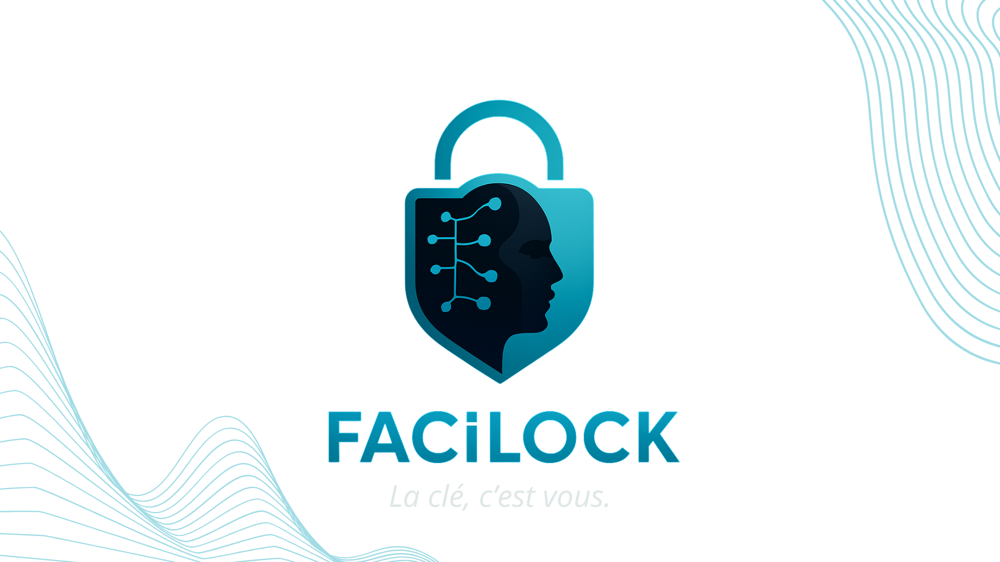
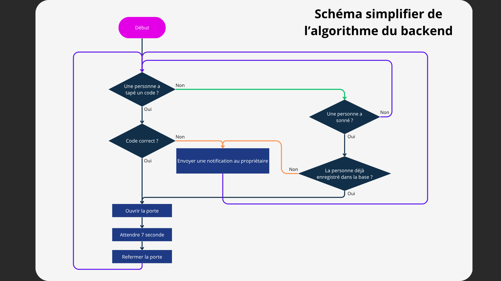
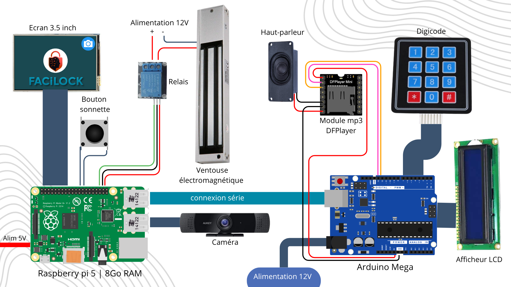
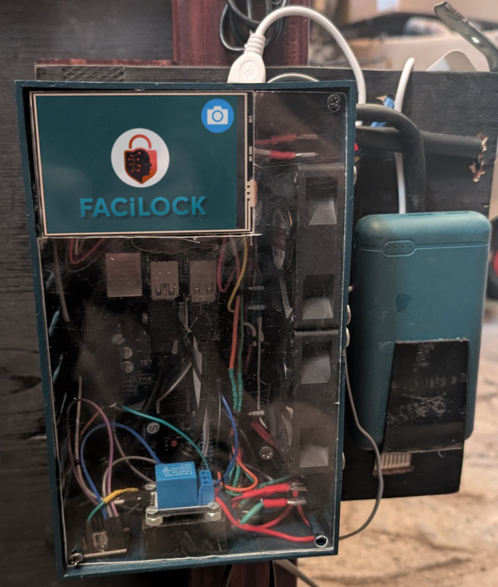

# 🔒 FaciLock — Système de verrouillage connecté intelligent

<p align="center">
  
</p>

> Un système de sécurité moderne basé sur la **reconnaissance faciale**, le **contrôle mobile** et des **modules embarqués sur Raspberry Pi**.

---
### 🗒️ NOTE - Ce projet a été réalisé en juin 2025 lors de mon bac pro système numérique. Fait avec les outils et les connaissances que j'avais à l'époque 
### ⚠️ Ce projet n'est pas maintenu
## 🌟 Projet en un coup d’œil

**FaciLock** est un système de sécurité intelligent qui combine :
- la **reconnaissance faciale** pour authentifier les utilisateurs,
- un **digicode** et un **bouton physique** pour le contrôle manuel,
- une **application mobile** pour le pilotage à distance et les alertes,
- et plusieurs **modules matériels** pour l’interactivité (écran, son, etc.).

---

## 🎯 Objectifs du projet

- 🔍 Identifier automatiquement les utilisateurs autorisés grâce à la **reconnaissance faciale**.  
- 🔘 Permettre un **contrôle manuel** via un bouton ou un digicode.  
- 📱 **Notifier en temps réel** l’utilisateur en cas d’accès refusé.  
- 🔑 **Contrôler et gérer l’accès** directement depuis l’application mobile.  
- 🧩 Ajouter des modules pour enrichir le système :
  - 🎵 **DFPlayer Mini** pour les effets sonores
  - 🖥️ **Écran LCD** pour l’affichage d’informations
  - 🔢 **Arduino** pour la gestion du digicode

---

## 🧠 Description du projet

**FaciLock** a été conçu sur un **Raspberry Pi 5 (8 Go)** pour offrir une solution de verrouillage connectée et sécurisée.

### 🔄 Fonctionnement général
1. Le système est en veille et affiche un écran d’accueil.  
2. Lorsqu’un **visiteur appuie sur le bouton**, la caméra s’active.  
3. Le système lance la **reconnaissance faciale** pendant quelques secondes.  
4. ✅ Si un visage autorisé est reconnu → **déverrouillage + notification de succès**.  
5. ❌ Sinon → **notification d’échec** envoyée à l’application mobile.  
6. ⏱️ Après un délai sans action, le système revient automatiquement à l’accueil.

---

### 🧭 Schéma de l’algorithme du backend

<p align="center">
  
</p>

---

## ⚙️ Technologies utilisées

### 🧩 Backend (Raspberry Pi)

- **Langage :** Python  
- **Librairies principales :**
  - `face_recognition`
  - `opencv-python`
  - `flask`
  - `gpiozero`
  - `pyserial`
  - `requests`
- **API REST Flask :**

| Méthode | Endpoint | Description |
|----------|-----------|-------------|
| `POST` | `/unlock` | Déverrouille la porte manuellement |
| `GET` | `/notifications` | Liste les vidéos capturées des visiteurs inconnus |
| `DELETE` | `/notifications/<video_id>` | Supprime une vidéo/notification |
| `GET` | `/authorized` | Liste les personnes autorisées |
| `POST` | `/authorized` | Ajoute une personne avec ses images (base64) |
| `PUT` | `/authorized/<old_name>` | Renomme une personne |
| `DELETE` | `/authorized/<name>` | Supprime une personne |
| `GET` | `/authorized/<name>/images` | Liste les images associées à un visage |
| `GET` | `/authorized/<name>/image` | Récupère une image spécifique |
| `DELETE` | `/authorized/<name>/image` | Supprime une image spécifique |
| `POST` | `/authorized_capture` | Capture directement des images depuis la caméra |
| `POST` | `/api/register_push_token` | Enregistre un token Expo pour les notifications push |
| `GET` | `/stream` | Envoie en temps réel l’état du verrou (`lock_status`) via SSE |

> Toutes les routes nécessitent un **token de sécurité** :  
> `?token=afsfr-356hytjdhiy-huy5429876njyu-y-gfdrsertgry`

📘 Voir les détails complets → [`backend/raspberrypi/README.md`](backend/raspberrypi/README.md)

---

### 📲 Application mobile

- Contrôle du verrou à distance  
- Réception des notifications push (via Expo)  
- Interface intuitive et claire  
- Communication directe avec le serveur Flask du Raspberry Pi  

📘 Voir l’app mobile → [`mobile_app/README.md`](mobile_app/README.md)

---

### 🧱 Modules matériels

| Module | Rôle |
|---------|------|
| **Raspberry Pi 5** | Unité centrale du système |
| **Caméra infrarouge** | Reconnaissance faciale |
| **Écran 3.5”** | Interface utilisateur principale |
| **Bouton poussoir** | Déclenchement de la reconnaissance |
| **Arduino** | Gestion du digicode |
| **DFPlayer Mini** | Effets sonores (verrouillage/déverrouillage) |

---

### 🔌 Schéma simplifié du câblage

<p align="center">
  
</p>

---

## 📁 Arborescence du projet

```
FaciLock/
├── backend/
│   ├── arduino/          # Arduino
|   |   ├── digicode.ino
|   |   ├── lcd-digicode-audio.ino
│   |   └── lcd-digicode.ino
|   └── raspberrypi       # Serveur Flask + reconnaissance faciale
|       ├── app.py
|       ├── icon/
│       ├── tetes/
│       ├── requirements.txt
|       └── ...
├── mobile_app/           # Application mobile (React Native)
│   ├── app/
│   ├── assets/
|   └── ...
├── docs/                 # Images, schémas, ressources
│   ├── banniere-facilock.png
│   ├── schema-simplifier-algorithme-backend.png
│   └── Schema-cablage-simple.png
└── README.md             # Présentation du projet
```

---

<p>
  
</p>

<p>
  Exemple du fonctionnement
    <video src="https://github.com/user-attachments/assets/030c9b42-d527-4f9c-b894-ffae5ed32931" width="400" alt="Exemple Digicode FaciLock">
</p>

## 👤 Auteur

**Constant Segretain**  
🎓 Élève en **BTS SIO SISR**  
📅 Année : 2025  
📫 [constantsegretain@gmail.com](mailto:constantsegretain@gmail.com)  
🌐 [github.com/ConstantSeg](https://github.com/ConstantSeg)

---

> _« Un projet mêlant sécurité, intelligence et innovation — la clé, c’est vous. »_
